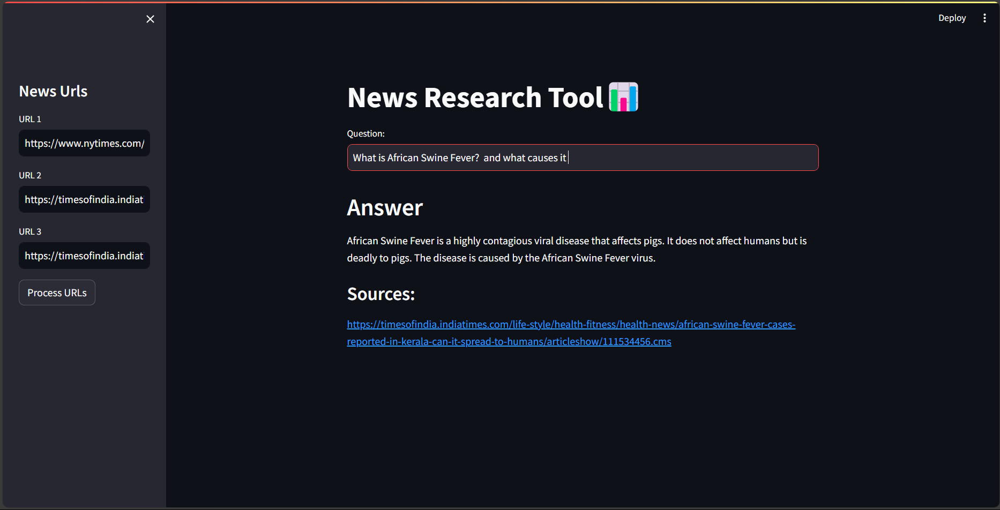

## News Bot 

This a RAG system which uses the openai api to process the query given by user and the urls provided.
Model process the information from the the URLs provided by the user . 

I have used **UnstructruredURLLoader** from langchain.document_loader and then the information extracted from the news converted into embeddings using the **OpenAIEmbeddings** .

Further these embeddings are stored in a vector database(FAISS).

User query is Converted to the embeddings and  cosine similarity is used to get the relevant chunks based on the query

Query and the Most relevant chunks are passed to the LLM Model(OpenAI) and LLM further give precise answer to the user as well the sources from where the answer is extracted. 

Here is the Workflow :

